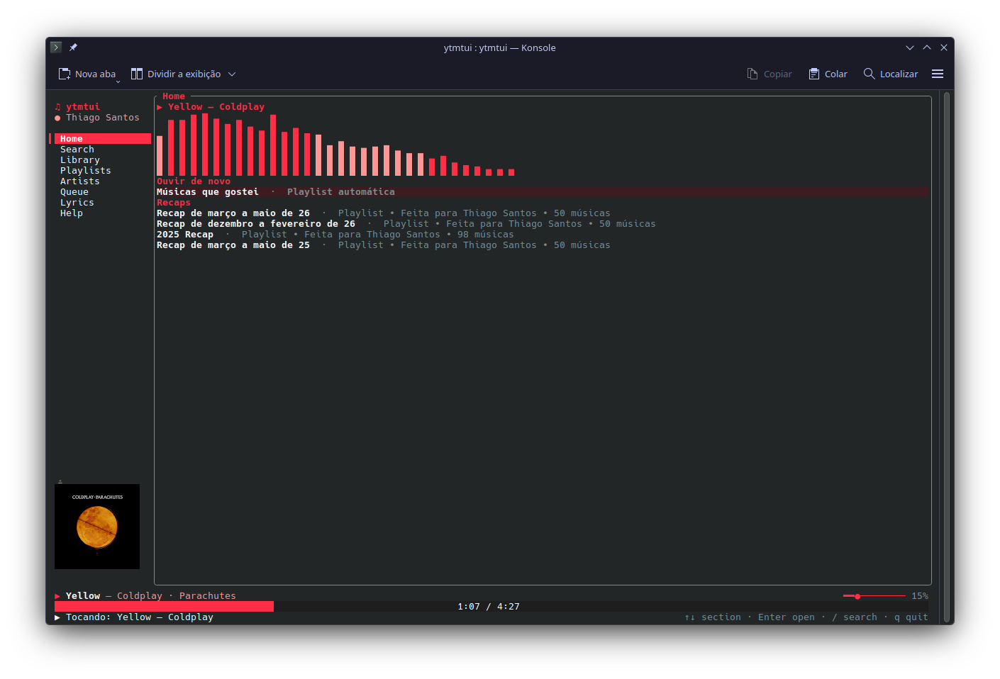
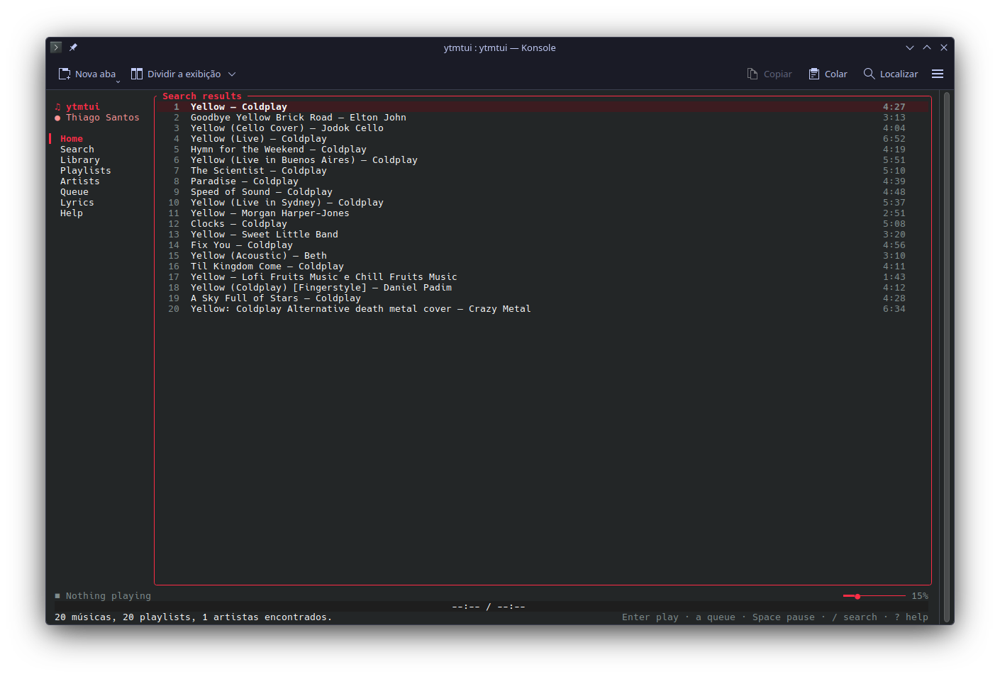
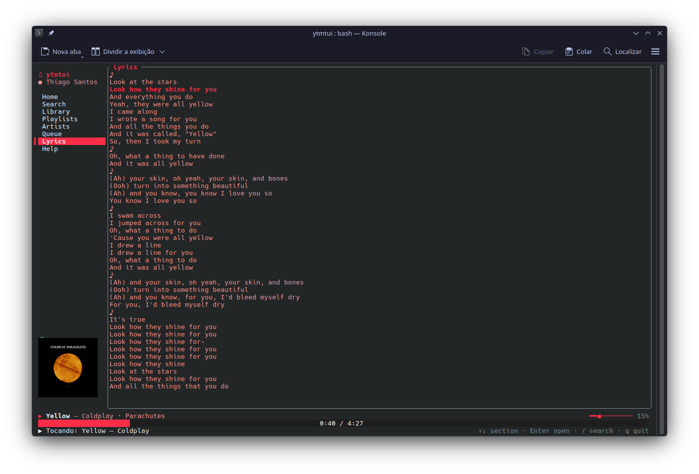
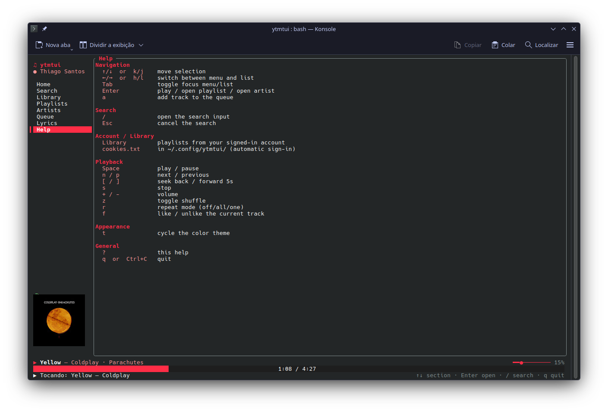

<h1 align="center">ytmtui</h1>

<p align="center">
  <strong>YouTube Music, tuned for the terminal.</strong><br />
  Search, play, queue, sign in, follow lyrics, and watch the audio breathe in your shell.
</p>

<p align="center">
  <a href="https://github.com/Itthiago034/ytmtui/actions/workflows/ci.yml">
    
  </a>
  <a href="https://github.com/Itthiago034/ytmtui/releases">
    
  </a>
  <a href="LICENSE">
    
  </a>
  
  
</p>

<p align="center">
  <a href="https://git.io/typing-svg">
    
  </a>
</p>

<p align="center">
  <strong>English</strong> · <a href="README.pt-BR.md">Português</a>
</p>

---

<p align="center">
  
</p>

## Why ytmtui?

| Instant Music | Terminal Native | Deep Enough |
|---|---|---|
| Search songs, artists, albums, and playlists without signing in. | Built with Rust, Ratatui, vim-style movement, and a keyboard-first layout. | Account library, synced lyrics, album art, radio, queue, themes, cache, and prefetch. |

ytmtui is a terminal client for **YouTube Music**. It talks to YouTube Music's
InnerTube API for metadata and uses `yt-dlp`, `ffmpeg`, and `rodio` for audio.
The result is a fast TUI that feels closer to a music workstation than a web
page squeezed into a terminal.

## What It Feels Like

| Home | Search |
|---|---|
|  |  |

| Synced Lyrics | Help |
|---|---|
|  |  |

## Quick Install

```bash
curl -fsSL https://raw.githubusercontent.com/Itthiago034/ytmtui/master/scripts/install.sh | bash
ytmtui
```

The script installs the latest prebuilt binary to `~/.local/bin` and warns when
runtime dependencies are missing. For source builds and first-run guidance, see
[Getting Started](docs/GETTING_STARTED.md).

## Choose Your Path

| I want to... | Go here |
|---|---|
| Install and play the first track | [Getting Started](docs/GETTING_STARTED.md) |
| See everything ytmtui can do | [Features](docs/FEATURES.md) |
| Sign in, refresh cookies, or fix anti-bot playback | [Authentication](docs/AUTHENTICATION.md) |
| Learn every shortcut | [Keymap](docs/KEYMAP.md) |
| Fix audio, cookies, lyrics, album art, or dependencies | [Troubleshooting](docs/TROUBLESHOOTING.md) |
| Understand the internals | [Architecture](docs/ARCHITECTURE.md) |
| Track releases | [Changelog](CHANGELOG.md) |
| Read in Portuguese | [README.pt-BR.md](README.pt-BR.md) |

## Highlights

| Area | Details |
|---|---|
| Search | Songs, artists, albums, and playlists are fetched in parallel and grouped by type. |
| Playback | `yt-dlp` resolves audio, `ffmpeg` remuxes AAC/M4A without re-encoding, and `rodio` plays it. |
| Account | Press `g` for Firefox-first discovery and an account preview; cookies change only after confirmation. |
| Lyrics | Synced karaoke-style lyrics when timestamps exist, plain text fallback otherwise. |
| Home | YouTube Music shelves plus local recently played history in `recent.json`. |
| Visuals | Real FFT visualizer, terminal album art, themed panels, progress, and status UI. |
| Flow | Queue, add-to-queue, radio/autoplay, shuffle, repeat, seek, volume, cache, and prefetch. |

## Requirements

| Dependency | Why |
|---|---|
| `yt-dlp` | Resolves YouTube Music audio streams |
| `ffmpeg` | Remuxes AAC/M4A for reliable playback |
| `deno` | Helps recent `yt-dlp` JavaScript challenges |
| Rust 1.75+ | Required only when building from source |
| ALSA dev libs | Needed for Linux source builds with audio |

## Development

```bash
cargo test
cargo fmt --all --check
cargo clippy --all-targets -- -D warnings
```

CI runs formatting, clippy, and tests on pushes/PRs. Release tags (`v*`) publish
Linux and macOS binaries through GitHub Actions.

Start with [Architecture](docs/ARCHITECTURE.md) if you want to contribute.

## Legal

This project is for educational purposes. Use of YouTube Music must comply with
YouTube's [Terms of Service](https://www.youtube.com/t/terms). The authors are
not responsible for misuse.

## License

MIT — see [LICENSE](LICENSE).
